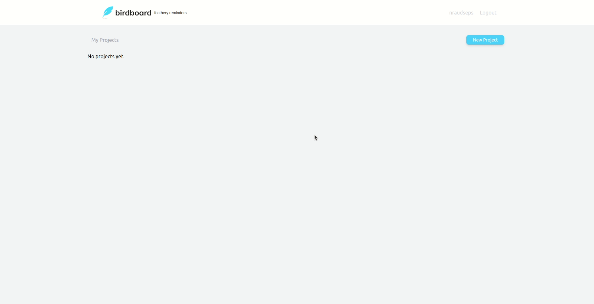
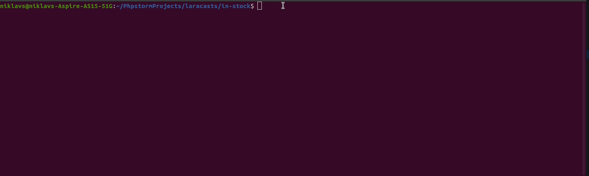
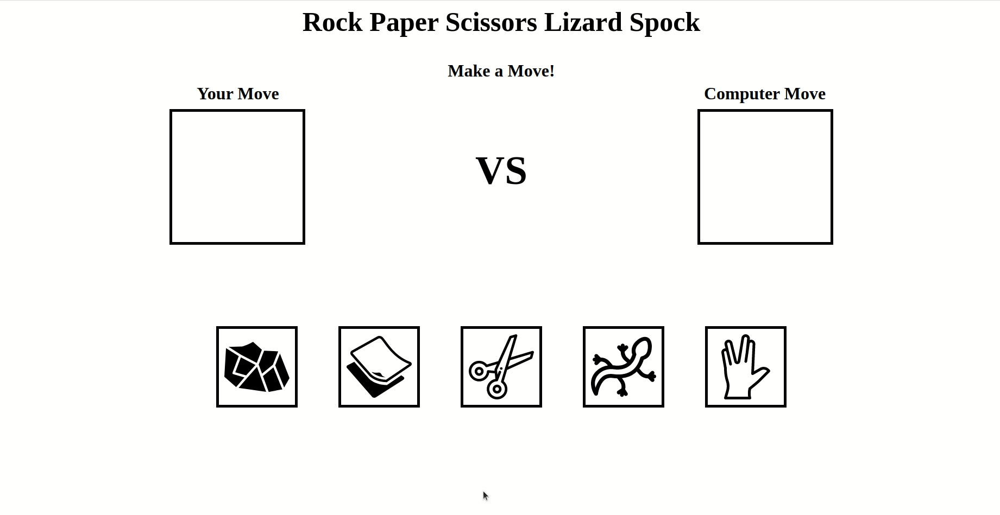

## Hi there 👋

My name is Niklavs. I am actively learning to become a better software engineer.

Currently learning 

Some of my Personal Projects:

  Birdboard: 

  Stock Tracker: 

  Rock Paper Scissors Lizard Spock: 

Click GIF to see the repo. ☝️

Links to my profiles: 

<!--
**NRaudseps/NRaudseps** is a ✨ _special_ ✨ repository because its `README.md` (this file) appears on your GitHub profile.

Here are some ideas to get you started:

- 🔭 I’m currently working on ...
- 🌱 I’m currently learning ...
- 👯 I’m looking to collaborate on ...
- 🤔 I’m looking for help with ...
- 💬 Ask me about ...
- 📫 How to reach me: ...
- 😄 Pronouns: ...
- ⚡ Fun fact: ...
-->
